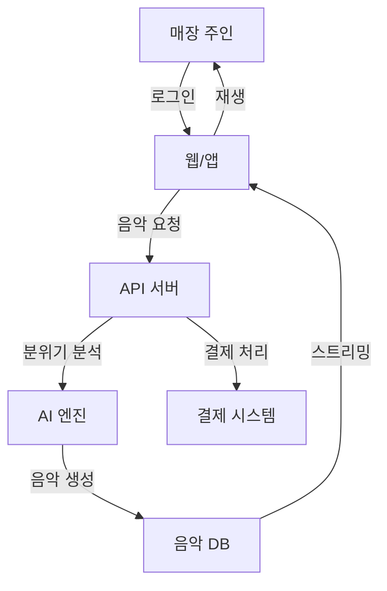

summary: 5강 - 협업·시각화 도구 활용: 서비스 구체화 실습
id: smart-job-lit-05
categories: smart-digital-literacy
tags: notion, canva, excalidraw, miro, collaboration, visualization
status: Published
authors: 박진우
Feedback Link: https://github.com/damianospark/peaceful-class/issues/new

# 5강 | 협업·시각화 도구 활용: 서비스 구체화 실습

## 오리엔테이션

Duration: 10

### 개요

이번 강의에서는 4강에서 기획한 "생성형 AI 기반의 저비용 매장 음악 제공 서비스"를 협업·시각화 도구를 활용하여 구체화합니다. 

취업 준비 단계에서 **문서화 능력**과 **시각적 커뮤니케이션 능력**은 실무 역량을 증명하는 핵심 요소입니다. 이번 실습을 통해 아이디어를 실제 프로젝트로 발전시키는 전 과정을 경험합니다.

### 🎯 학습 목표

1. ✅ **Notion**으로 팀 프로젝트 페이지 구성 및 일정 관리
2. ✅ **Canva**로 시각적 문서와 피치덱 제작
3. ✅ **Excalidraw/Miro**로 서비스 구조와 아이디어 시각화
4. ✅ 실시간 협업 기능을 활용한 팀 워크 경험

<aside class="info">
협업 도구 활용 능력은 2025년 채용 시장에서 가장 주목받는 스킬 중 하나입니다. 특히 원격 근무가 일반화된 지금, 디지털 협업 역량은 필수입니다.
</aside>

### 실습 시나리오

4강에서 기획한 서비스를 다음 단계로 발전시킵니다:

| 단계 | 도구 | 활동 | 산출물 |
|------|------|------|--------|
| **1. 프로젝트 구조화** | Notion | 프로젝트 페이지 생성, 일정 관리 | 프로젝트 홈 페이지 |
| **2. 서비스 구조 설계** | Excalidraw | 서비스 아키텍처, 사용자 플로우 | 시스템 다이어그램 |
| **3. 시각적 문서 제작** | Canva | 인포그래픽, 1-page 요약 | 비주얼 문서 |
| **4. 피치덱 제작** | Canva | 투자자용 발표 자료 | 피치덱 (5-7장) |
| **5. 팀 협업 실습** | 전체 | 실시간 공동 작업 | 통합 프로젝트 |

### 준비사항

#### 필수 도구 계정 생성
1. **Notion** ([https://notion.so](https://notion.so)) - 무료 계정
2. **Canva** ([https://canva.com](https://canva.com)) - 무료 계정
3. **Excalidraw** ([https://excalidraw.com](https://excalidraw.com)) - 계정 불필요 (선택적 저장)
4. **Miro** ([https://miro.com](https://miro.com)) - 무료 계정 (선택사항)

#### 준비물
- 4강에서 작성한 사업계획서
- 협업할 팀원의 이메일 주소 (실습용)

## 협업·시각화 도구 소개

Duration: 20

### 1. Notion: 올인원 협업 플랫폼

**Notion**은 문서, 데이터베이스, 프로젝트 관리를 하나로 통합한 협업 도구입니다.

#### 주요 기능
- 📝 **위키/문서**: 체계적인 문서 작성
- 🗂️ **데이터베이스**: 작업, 일정, 리소스 관리
- 👥 **협업**: 실시간 공동 편집, 댓글, 멘션
- 🔗 **통합**: 다른 도구들과 연결

#### 활용 사례
- 스타트업의 프로젝트 관리 허브
- 개인 포트폴리오 웹사이트
- 팀 업무 지식 베이스
- 학습 노트 및 일정 관리

#### 왜 Notion인가?
> "2025년 가장 많이 사용되는 협업 도구 중 하나입니다. 많은 스타트업과 IT 기업이 Notion을 업무 플랫폼으로 채택하고 있어, 이를 다룰 줄 아는 것만으로도 취업 시 가산점이 됩니다."

### 2. Canva: 비디자이너를 위한 디자인 도구

**Canva**는 전문 디자이너가 아니어도 전문적인 시각 자료를 만들 수 있는 도구입니다.

#### 주요 기능
- 🎨 **템플릿**: 수만 개의 디자인 템플릿
- 🖼️ **에셋 라이브러리**: 사진, 아이콘, 일러스트
- 📊 **차트**: 데이터 시각화
- 🎬 **다양한 포맷**: 문서, 프레젠테이션, 소셜미디어, 비디오

#### 활용 사례
- 사업 피치덱 (투자 제안서)
- 인포그래픽 (복잡한 정보를 시각적으로)
- SNS 콘텐츠
- 포트폴리오 및 이력서

#### 왜 Canva인가?
> "PowerPoint나 Keynote보다 훨씬 세련된 결과물을 빠르게 만들 수 있습니다. 특히 투자자나 채용 담당자에게 첫인상을 좌우하는 시각 자료에서 큰 차이를 만듭니다."

### 3. Excalidraw: 손그림 스타일 다이어그램 도구

**Excalidraw**는 손으로 그린 듯한 느낌의 다이어그램을 만드는 오픈소스 도구입니다.

#### 주요 기능
- ✏️ **스케치 스타일**: 친근하고 비형식적인 느낌
- 🔄 **실시간 협업**: 여러 명이 동시에 그리기
- 💾 **간편한 저장**: 파일로 내보내기 또는 링크 공유
- 🤖 **AI 통합**: ChatGPT로 생성한 다이어그램 임포트 가능

#### 활용 사례
- 시스템 아키텍처 설계
- 사용자 플로우 차트
- 브레인스토밍 마인드맵
- 프로세스 다이어그램

#### 특징: Mermaid와의 통합
**Mermaid**는 텍스트로 다이어그램을 그리는 마크다운 문법입니다. ChatGPT에게 "Mermaid 문법으로 플로우차트 그려줘"라고 요청하면, 그 코드를 Excalidraw에서 시각화할 수 있습니다.

### 4. Miro: 무한 캔버스 협업 도구

**Miro**는 화이트보드처럼 사용할 수 있는 무한 캔버스 협업 도구입니다.

#### 주요 기능
- 🎯 **브레인스토밍**: 포스트잇, 마인드맵
- 📋 **프레임워크 템플릿**: 비즈니스 모델 캔버스, 린 캔버스 등
- 👥 **실시간 협업**: 팀원 커서 실시간 표시
- 🔌 **통합**: Slack, Jira, Notion 등과 연동

#### 활용 사례
- 디자인 씽킹 워크숍
- 애자일 스프린트 플래닝
- 사용자 여정 맵핑
- 원격 팀 회의

<aside class="info">
<strong>Excalidraw vs Miro 선택 가이드</strong>:
- <strong>가볍고 빠른 다이어그램</strong> → Excalidraw (무료, 설치 불필요)
- <strong>복잡한 협업 워크숍</strong> → Miro (템플릿 풍부, 팀 기능 강력)
- <strong>ChatGPT와 연동</strong> → Excalidraw (Mermaid 문법 지원)

실습에서는 두 도구 모두 체험합니다!
</aside>

### 도구별 협업 기능 비교

| 기능 | Notion | Canva | Excalidraw | Miro |
|------|--------|-------|------------|------|
| 실시간 공동 편집 | ✅ | ✅ | ✅ | ✅ |
| 댓글/피드백 | ✅ | ✅ | ❌ | ✅ |
| 버전 관리 | ✅ | ✅ | ❌ | ✅ |
| 템플릿 | ✅ | ✅✅✅ | ❌ | ✅✅ |
| 모바일 앱 | ✅ | ✅ | ❌ | ✅ |
| 무료 플랜 | ✅ | ✅ | ✅✅ | ✅ (제한적) |
| 학습 난이도 | 중 | 하 | 하 | 중 |

## 실습 준비: 도구 계정 생성

Duration: 15

### Notion 시작하기

#### Step 1: 계정 생성
1. [https://notion.so](https://notion.so) 접속
2. "Get Notion free" 클릭
3. 이메일 또는 Google 계정으로 가입
4. 용도 선택: "For personal use" 선택

#### Step 2: 워크스페이스 생성
1. 워크스페이스 이름: "취업준비 프로젝트" 또는 원하는 이름
2. 템플릿 건너뛰기 (Skip)
3. 빈 페이지에서 시작

#### Step 3: 인터페이스 둘러보기
- **왼쪽 사이드바**: 페이지 목록
- **메인 영역**: 콘텐츠 작성 공간
- **오른쪽 상단**: 공유 버튼

<aside class="info">
<strong>Notion 팁</strong>: Notion은 처음에는 복잡해 보이지만, "모든 것이 블록"이라는 개념만 이해하면 쉽습니다. 슬래시(/)를 누르면 추가할 수 있는 블록 목록이 나옵니다.
</aside>

### Canva 시작하기

#### Step 1: 계정 생성
1. [https://canva.com](https://canva.com) 접속
2. "Sign up" 클릭
3. Google, Facebook 또는 이메일로 가입
4. 학생이라면 "Canva for Education" 신청 가능 (무료 Pro 기능)

#### Step 2: 인터페이스 둘러보기
1. **홈**: 템플릿 탐색
2. **Create a design**: 새 디자인 시작
3. **Projects**: 내 작업물
4. **Templates**: 카테고리별 템플릿

#### Step 3: 첫 디자인 만들기 (연습)
1. "Create a design" → "Presentation" 선택
2. 템플릿 하나 선택해서 열기
3. 텍스트 클릭해서 수정해보기
4. 이미지 드래그해서 이동해보기
5. 좌측 메뉴에서 "Elements" → 도형이나 아이콘 추가해보기

### Excalidraw 시작하기

#### Step 1: 접속 (계정 불필요)
1. [https://excalidraw.com](https://excalidraw.com) 접속
2. 바로 그리기 시작 가능!

#### Step 2: 기본 도구 익히기
- **도형 도구**: 사각형, 원, 다이아몬드, 화살표
- **선택 도구**: 객체 선택 및 이동
- **텍스트 도구**: 텍스트 추가
- **손 도구**: 캔버스 이동

#### Step 3: 저장 및 공유
- **저장**: 상단 메뉴 → "Save" (브라우저 로컬에 자동 저장)
- **내보내기**: 메뉴 → "Export image" (PNG/SVG)
- **공유**: 메뉴 → "Live collaboration" → 링크 복사

#### Step 4: 연습 그리기
간단한 플로우차트를 그려보세요:
1. 사각형 3개 그리기
2. 화살표로 연결
3. 각 사각형에 텍스트 추가

<aside class="info">
<strong>Excalidraw 단축키</strong>:
- `R`: 사각형
- `O`: 원
- `A`: 화살표
- `T`: 텍스트
- `V`: 선택 도구
- `Ctrl/Cmd + Z`: 되돌리기
</aside>

### Miro 시작하기 (선택사항)

#### Step 1: 계정 생성
1. [https://miro.com](https://miro.com) 접속
2. "Sign up free" 클릭
3. 이메일 또는 Google 계정으로 가입

#### Step 2: 첫 보드 만들기
1. "Create new board" 클릭
2. 빈 캔버스 선택
3. 좌측 도구바에서 "Sticky notes" 클릭해서 포스트잇 추가
4. 마우스 휠로 줌인/줌아웃

### 실습 환경 최종 점검

다음 탭들을 브라우저에 열어두세요:

1. ✅ **Notion** - 프로젝트 페이지용
2. ✅ **Canva** - 디자인 작업용
3. ✅ **Excalidraw** - 다이어그램용
4. ✅ **Google Docs** (또는 메모장) - 4강 사업계획서
5. ✅ **이 코드랩** - 실습 가이드

## 실습 1: Notion 프로젝트 페이지 구성

Duration: 30

### 실습 목표

"생성형 AI 기반의 저비용 매장 음악 제공 서비스" 프로젝트를 위한 **팀 협업 허브**를 Notion에 구축합니다.

### Step 1: 프로젝트 홈 페이지 만들기

#### 1-1. 새 페이지 생성
1. Notion 좌측 사이드바 하단 "+ Add a page" 클릭
2. 페이지 제목: "🎵 매장 음악 AI 서비스"
3. 아이콘 변경: 제목 왼쪽 아이콘 클릭 → 이모지 또는 이미지 선택

#### 1-2. 프로젝트 개요 섹션 작성
페이지에 다음 내용을 입력하세요:

```
# 프로젝트 개요

## 🎯 미션
소상공인을 위한 저비용, 고품질 매장 음악 솔루션 제공

## 💡 핵심 가치 제안
- AI 생성 음악으로 저작권료 걱정 없음
- 매장 분위기 맞춤 자동 선곡
- 월 1만원 이하의 합리적인 가격

## 📅 프로젝트 기간
2025년 1월 ~ 2025년 6월 (6개월)
```

<aside class="info">
<strong>Notion 마크다운 팁</strong>:
- `#` = 제목 1 (큰 제목)
- `##` = 제목 2 (중간 제목)
- `###` = 제목 3 (작은 제목)
- `-` = 불릿 포인트
- `[ ]` = 체크박스
</aside>

### Step 2: 팀 구성 및 역할 정의

#### 2-1. 팀원 섹션 추가
개요 아래에 다음을 추가하세요:

```
---

# 👥 팀 구성

| 역할 | 이름 | 담당 업무 |
|------|------|-----------|
| PM | [이름] | 프로젝트 총괄, 일정 관리 |
| 개발 | [이름] | AI 모델 개발, 백엔드 |
| 개발 | [이름] | 프론트엔드, 앱 개발 |
| 디자인 | [이름] | UI/UX, 브랜딩 |
| 비즈니스 | [이름] | 시장 조사, 영업 |
```

표를 만드는 방법:
1. `/table` 입력 → "Table - Inline" 선택
2. 열과 행 추가/삭제
3. 또는 위 마크다운을 직접 붙여넣기

### Step 3: 프로젝트 일정 데이터베이스 만들기

#### 3-1. 타임라인 데이터베이스 추가
1. 새 줄에서 `/timeline` 입력
2. "Timeline view" 선택
3. 데이터베이스 제목: "프로젝트 로드맵"

#### 3-2. 주요 마일스톤 입력
다음 항목들을 추가하세요:

**1월: 기획 단계**
- 시장 조사 및 경쟁 분석 (1/1 - 1/15)
- 서비스 기획서 작성 (1/16 - 1/31)

**2월: 설계 단계**
- 기술 스택 선정 (2/1 - 2/7)
- UI/UX 디자인 (2/8 - 2/28)

**3월: 개발 단계**
- MVP 개발 (3/1 - 3/31)

**4월: 테스트 및 개선**
- 베타 테스트 (4/1 - 4/15)
- 피드백 반영 및 개선 (4/16 - 4/30)

**5월: 런칭 준비**
- 마케팅 자료 제작 (5/1 - 5/15)
- 파일럿 고객 확보 (5/16 - 5/31)

**6월: 정식 런칭**
- 서비스 오픈 (6/1)
- 초기 운영 및 모니터링 (6/1 - 6/30)

#### 타임라인에 항목 추가하는 방법:
1. "New" 버튼 클릭
2. 제목 입력
3. 날짜 범위 설정 (Date 컬럼 클릭)
4. 속성 추가 (담당자, 상태 등)

### Step 4: 작업 관리 칸반 보드 만들기

#### 4-1. 새 데이터베이스 추가
1. 페이지 하단에 `/board` 입력
2. "Board view" 선택
3. 데이터베이스 제목: "📋 작업 관리"

#### 4-2. 칸반 보드 컬럼 설정
기본 컬럼 이름을 다음과 같이 변경:
- **To Do** (해야 할 일)
- **In Progress** (진행 중)
- **Review** (검토 중)
- **Done** (완료)

#### 4-3. 샘플 작업 카드 추가
각 컬럼에 다음과 같은 작업들을 추가해보세요:

**To Do:**
- AI 음악 생성 모델 조사
- 경쟁사 가격 정책 분석
- 로고 디자인 시안 3개 제작

**In Progress:**
- 사업계획서 작성 (4강에서 진행 중!)
- Notion 프로젝트 페이지 구축 (지금 하고 있는 것)

**Review:**
- 타겟 고객 인터뷰 결과 정리

**Done:**
- 시장 조사 완료
- 팀 킥오프 미팅

#### 4-4. 작업 카드에 속성 추가
각 카드를 클릭하여:
- **담당자** (Person): 본인 또는 팀원 이름
- **우선순위** (Select): High / Medium / Low
- **마감일** (Date): 목표 완료일
- **태그** (Multi-select): #개발 #디자인 #비즈니스

### Step 5: 리소스 및 문서 섹션

#### 5-1. 토글 블록으로 문서 정리
```
---

# 📚 프로젝트 문서

> 주요 문서 및 리소스를 여기에 모아둡니다.
```

아래에 다음 토글들을 추가하세요:

1. `/toggle` 입력 → "Toggle list" 선택
2. 제목: "📄 기획 문서"
3. 토글 내부에:
   - 사업계획서 (4강에서 작성)
   - 시장 조사 리포트
   - 경쟁 분석

같은 방식으로:
- "🎨 디자인 자료"
- "💻 기술 문서"
- "📊 데이터 및 리서치"

#### 5-2. 4강 사업계획서 링크 추가
1. "기획 문서" 토글 열기
2. "사업계획서" 옆에 링크 추가:
   - Google Docs 링크를 복사
   - Notion에 붙여넣기 (자동으로 북마크 카드 생성)

### Step 6: 회의록 템플릿 만들기

#### 6-1. 템플릿 버튼 추가
1. 페이지 하단에 `/button` 입력
2. 버튼 이름: "➕ 새 회의록 작성"

#### 6-2. 회의록 템플릿 내용
버튼 설정에서 다음 템플릿을 추가:

```
# 회의록 - [날짜]

## 📅 회의 정보
- **날짜**: 
- **참석자**: 
- **시간**: 
- **장소**: 

## 📌 안건
1. 
2. 
3. 

## 💬 논의 내용

### 안건 1: 
- 

### 안건 2:
- 

## ✅ 결정 사항
- 

## 📝 액션 아이템
| 작업 | 담당자 | 마감일 |
|------|--------|--------|
|      |        |        |

## 🔜 다음 회의
- **날짜**: 
- **안건**: 
```

### Step 7: 페이지 공유 및 협업 설정

#### 7-1. 페이지 공유
1. 우측 상단 "Share" 버튼 클릭
2. "Share to web" 토글 켜기 (공개 링크 생성)
3. 또는 "Invite" → 팀원 이메일 입력 (비공개 협업)

#### 7-2. 권한 설정
- **Can edit**: 수정 가능 (팀원)
- **Can comment**: 댓글만 가능
- **Can view**: 읽기만 가능

<aside class="info">
<strong>협업 팁</strong>: 실제 팀 프로젝트에서는 팀원을 "Can edit" 권한으로 초대하세요. 외부 자문위원이나 멘토는 "Can comment" 권한으로 초대하면 피드백을 받을 수 있습니다.
</aside>

### Step 8: 최종 점검

완성된 Notion 페이지에는 다음이 포함되어야 합니다:

1. ✅ 프로젝트 개요 및 미션
2. ✅ 팀 구성 및 역할
3. ✅ 타임라인 (6개월 로드맵)
4. ✅ 칸반 보드 (작업 관리)
5. ✅ 문서 리소스 섹션
6. ✅ 회의록 템플릿
7. ✅ 공유 설정 완료

## 실습 2: Excalidraw로 서비스 구조 시각화

Duration: 25

### 실습 목표

"매장 음악 AI 서비스"의 **시스템 아키텍처**와 **사용자 플로우**를 시각적으로 표현합니다.

### Part A: ChatGPT로 Mermaid 다이어그램 생성

먼저 ChatGPT를 활용하여 다이어그램 코드를 생성합니다.

#### Step 1: ChatGPT에 프롬프트 입력

```
당신은 시스템 아키텍트입니다.

"생성형 AI 기반의 저비용 매장 음악 제공 서비스"의 
시스템 구조를 Mermaid 문법으로 그려주세요.

시스템 구성요소:
1. 사용자 (매장 주인)
2. 웹/앱 프론트엔드
3. 백엔드 API 서버
4. AI 음악 생성 엔진
5. 음악 데이터베이스
6. 결제 시스템

flowchart 형식으로 작성하고, 
각 구성요소 간의 데이터 흐름을 화살표로 표시해주세요.
```

#### Step 2: Mermaid 코드 복사

ChatGPT가 생성한 Mermaid 코드를 복사하세요. 예시:



### Part B: Excalidraw에서 다이어그램 그리기

#### Step 3: Excalidraw에서 수동으로 그리기

Mermaid 코드를 참고하여 Excalidraw에서 직접 그립니다:

1. **사각형 그리기** (R 키)
   - "매장 주인"
   - "웹/앱 프론트엔드"
   - "API 서버"
   - "AI 음악 생성 엔진"
   - "음악 DB"
   - "결제 시스템"

2. **화살표로 연결** (A 키)
   - 각 구성요소를 논리적 흐름에 따라 연결

3. **텍스트 추가** (T 키)
   - 화살표 위에 "로그인", "요청", "응답" 등 라벨 추가

4. **색상 구분**
   - 프론트엔드: 파란색
   - 백엔드: 초록색
   - AI: 보라색
   - 외부 서비스: 노란색

#### Step 4: 사용자 플로우 그리기

새로운 영역에 사용자 여정(User Journey)을 그립니다:

```
[매장 주인 회원가입]
    ↓
[매장 정보 입력]
(매장 유형, 크기, 분위기)
    ↓
[음악 스타일 선택]
(팝, 재즈, 클래식 등)
    ↓
[AI가 플레이리스트 생성]
    ↓
[무료 체험 (7일)]
    ↓
[구독 결제]
    ↓
[매일 자동 음악 재생]
```

이를 Excalidraw에서 시각화:
- 단계별로 사각형 또는 둥근 사각형
- 아래로 흐르는 화살표
- 각 단계에서 분기가 있다면 다이아몬드 모양으로 결정 포인트 표시

### Part C: 비즈니스 모델 시각화

#### Step 5: 수익 구조 다이어그램

화면 다른 영역에 **비즈니스 모델**을 그립니다:

```
[소상공인 고객] --월 9,900원--> [우리 서비스]
                                      ↓
                    ┌─────────────────┼─────────────────┐
                    ↓                 ↓                 ↓
              [AI 서버 비용]    [마케팅 비용]    [인건비]
                (30%)              (20%)          (30%)
                                      ↓
                               [영업이익 20%]
```

<aside class="info">
<strong>Excalidraw 팁</strong>: 
- 여러 객체를 동시에 선택: Shift + 클릭
- 정렬: 선택 후 우클릭 → Align
- 그룹화: 선택 후 Ctrl/Cmd + G
- 복제: 선택 후 Ctrl/Cmd + D
</aside>

### Step 6: 협업 및 공유

#### 6-1. 실시간 협업 링크 생성
1. 좌측 상단 메뉴 → "Live collaboration"
2. "Start session" 클릭
3. 링크 복사
4. 팀원과 공유 → 동시에 편집 가능!

#### 6-2. Notion에 임베드
1. Excalidraw에서 "Export image" → PNG 다운로드
2. Notion 프로젝트 페이지로 이동
3. "기술 문서" 섹션에 이미지 업로드
4. 또는 Excalidraw 링크를 Notion에 붙여넣기 (임베드 됨)

### Step 7: 고급 기능 - 라이브러리 활용

Excalidraw는 재사용 가능한 라이브러리를 지원합니다:

1. 자주 사용하는 아이콘이나 컴포넌트를 그립니다
2. 선택 후 우클릭 → "Add to library"
3. 다음번에 좌측 메뉴 "Library"에서 다시 사용

**추천 라이브러리**: 
- AWS 아키텍처 아이콘
- 사용자 인터페이스 컴포넌트
- 플로우차트 기호

excalidraw.com의 "Libraries" 섹션에서 커뮤니티 라이브러리를 다운로드할 수 있습니다.

## 실습 3: Canva로 시각적 문서 제작

Duration: 30

### 실습 목표

투자자나 경진대회에 제출할 **1-Page 요약 문서**와 **피치덱**을 Canva로 제작합니다.

### Part A: 1-Page 인포그래픽 제작

#### Step 1: 템플릿 선택
1. Canva 홈에서 "Create a design" → "Infographic" 선택
2. 검색창에 "business proposal" 또는 "startup pitch" 입력
3. 마음에 드는 템플릿 선택 (무료 템플릿 추천)

#### Step 2: 내용 커스터마이징

템플릿을 우리 서비스에 맞게 수정합니다:

**1) 헤더 섹션**
- 제목: "생성형 AI 기반 매장 음악 서비스"
- 부제: "소상공인을 위한 저비용 고품질 솔루션"
- 로고 영역: 서비스 이름 또는 간단한 로고 (Canva Elements에서 음악 아이콘 검색)

**2) 문제 제기 섹션**
```
😰 소상공인의 고민

💰 높은 저작권료
   월 5~10만원의 부담

🎵 선곡의 어려움
   매장 분위기에 맞는 음악 찾기 힘듦

⏰ 관리의 번거로움
   시간대별 음악 변경 불가
```

**3) 솔루션 섹션**
```
💡 우리의 솔루션

🤖 AI 자동 생성
   저작권 걱정 없는 오리지널 음악

🎯 맞춤형 선곡
   매장 유형별 최적화된 플레이리스트

📱 간편한 관리
   앱으로 언제든지 설정 변경
```

**4) 숫자로 보는 가치**
```
₩9,900     50,000곡      30분
월 구독료   AI 생성 음악   맞춤 플레이리스트
                          생성 시간
```

**5) 비즈니스 모델**
간단한 플로우차트 또는 아이콘으로 표현:
```
소상공인 → 월 구독 → 무제한 음악 스트리밍
```

#### Step 3: 디자인 요소 추가

**색상 일관성**
1. 좌측 메뉴 "Brand Kit" (또는 Elements)
2. 브랜드 컬러 3가지 선택:
   - 주 색상: 파란색 (#2196F3)
   - 보조 색상: 보라색 (#9C27B0)
   - 강조 색상: 주황색 (#FF9800)

**아이콘 및 일러스트**
1. 좌측 "Elements" 메뉴
2. 검색: "music", "AI", "store", "headphone" 등
3. 관련 아이콘을 섹션별로 배치

**차트 추가** (선택사항)
1. "Elements" → "Charts"
2. 막대 그래프나 파이 차트 추가
3. 데이터 입력: 시장 규모, 성장률 등

<aside class="info">
<strong>디자인 원칙</strong>:
- <strong>일관성</strong>: 같은 폰트와 색상 사용
- <strong>여백</strong>: 텍스트와 이미지 사이 충분한 간격
- <strong>계층</strong>: 중요한 정보는 크고 굵게
- <strong>정렬</strong>: 모든 요소를 정렬선에 맞추기
</aside>

#### Step 4: 완성 및 다운로드
1. 우측 상단 "Share" → "Download"
2. 파일 형식: PNG (고품질) 또는 PDF
3. 다운로드 후 Notion에 업로드

### Part B: 피치덱 (투자 제안서) 제작

#### Step 5: 프레젠테이션 템플릿 선택
1. "Create a design" → "Presentation"
2. 검색: "startup pitch deck" 또는 "business presentation"
3. 현대적이고 깔끔한 디자인 선택

#### Step 6: 슬라이드 구성 (7-10장)

**Slide 1: 표지**
- 서비스명
- 태그라인: "AI가 만드는 매장 음악, 부담은 줄이고 품질은 높이고"
- 팀명 및 날짜

**Slide 2: 문제 정의**
- 제목: "소상공인의 숨은 고민"
- 3가지 핵심 문제점
- 실제 인터뷰 인용구 (있다면)

**Slide 3: 솔루션**
- 제목: "AI로 해결하는 매장 음악"
- 핵심 기능 3가지 (아이콘 + 설명)
- 스크린샷 모형 (Canva Elements의 모바일 목업 활용)

**Slide 4: 작동 원리**
- 제목: "How it works"
- 사용자 플로우 (Excalidraw에서 만든 것 활용)
- 3-4단계로 간결하게

**Slide 5: 시장 기회**
- 제목: "거대한 시장, 명확한 기회"
- 타겟 시장 규모 (숫자)
- 성장 가능성 (그래프)
- TAM / SAM / SOM (해당되는 경우)

**Slide 6: 비즈니스 모델**
- 제목: "수익 모델"
- 가격 정책: 월 9,900원 구독제
- 추가 수익원 (프리미엄 기능, B2B 등)
- 예상 매출 (단순 계산)

**Slide 7: 경쟁 우위**
- 제목: "왜 우리인가?"
- 경쟁사 vs 우리 (비교표)
- 핵심 차별화 포인트 3가지

**Slide 8: 실행 계획**
- 제목: "6개월 로드맵"
- 타임라인 (Notion에서 만든 것 시각화)
- 주요 마일스톤

**Slide 9: 팀 소개**
- 제목: "누가 만드나요?"
- 팀원 사진 + 역할 + 간단한 경력
- "우리는 이 문제를 해결할 수 있습니다"

**Slide 10: 마무리 (Call to Action)**
- 제목: "함께 시작하실래요?"
- 연락처: 이메일, 웹사이트
- QR 코드 (Notion 프로젝트 페이지 링크)

#### Step 7: 디자인 일관성 유지

**폰트 통일**
- 제목: 굵고 큰 폰트 (예: Montserrat Bold, 36pt)
- 본문: 읽기 쉬운 폰트 (예: Open Sans Regular, 18pt)

**색상 팔레트**
- 모든 슬라이드에 동일한 색상 사용
- 강조할 부분만 포인트 컬러

**이미지 스타일**
- 일러스트 사용 시: 같은 스타일로 통일
- 사진 사용 시: 필터를 동일하게

#### Step 8: 애니메이션 및 전환 효과 (선택)
1. 슬라이드 선택
2. 우측 상단 "Animate" 클릭
3. 부드러운 전환 효과 선택 (과하지 않게!)

#### Step 9: 발표자 노트 추가
1. 각 슬라이드에서 하단 "Notes" 클릭
2. 발표할 내용 키워드 정리
3. 발표 시간 예상 (슬라이드당 1-2분)

#### Step 10: 완성 및 공유
1. "Share" → "Present" (발표 모드 테스트)
2. "Download" → PDF 또는 PowerPoint
3. "Share" → "Anyone with the link" → 링크 복사
4. 링크를 Notion에 저장

### Part C: 보너스 - SNS 홍보 자료

시간이 남는다면 SNS 홍보용 이미지도 제작해보세요:

#### 인스타그램 포스트 (1:1 비율)
1. "Instagram Post" 템플릿 선택
2. 핵심 메시지 1가지만 강조
3. 예시: "매달 8만원 음악 저작권료? 이제 9,900원이면 충분합니다."

#### 페이스북 커버 이미지
1. "Facebook Cover" 템플릿
2. 서비스 비전을 시각적으로 표현

## 실습 4: 팀 협업 시뮬레이션

Duration: 20

### 실습 목표

실제 팀 프로젝트처럼 **실시간 협업 기능**을 활용하여 함께 작업합니다.

### 시나리오: 피드백 반영 및 개선

팀장이 완성한 피치덱을 팀원들에게 공유하고, 실시간으로 피드백을 받아 수정합니다.

### Step 1: 역할 분담 (1인 3역)

실제 팀이 없다면, 브라우저 창을 3개 열어서 실습하세요:

1. **일반 Chrome 창**: 팀장 (본인)
2. **시크릿 창 1**: 팀원 A (가상)
3. **시크릿 창 2**: 팀원 B (가상)

각 창에서 다른 Google 계정으로 로그인 (또는 게스트 권한)

### Step 2: Notion 실시간 협업

#### 2-1. 팀장 (본인)
1. Notion 프로젝트 페이지 열기
2. "Share" → 팀원 이메일 초대 (또는 링크 복사)
3. "칸반 보드"에 새 작업 추가: "피치덱 1차 검토"

#### 2-2. 팀원 A (시크릿 창 1)
1. 초대 링크로 Notion 페이지 접속
2. "피치덱 1차 검토" 카드를 "In Progress"로 이동
3. 카드 클릭 → 댓글 추가:
   ```
   @팀장 슬라이드 3의 "작동 원리" 부분이 복잡해 보여요. 
   더 간단한 플로우차트로 바꾸면 어떨까요?
   ```

#### 2-3. 팀원 B (시크릿 창 2)
1. Notion 페이지 접속
2. "회의록" 섹션에 새 페이지 추가
3. 오늘 날짜로 회의록 작성 시작
4. 실시간으로 팀장과 팀원 A의 커서가 보임!

<aside class="info">
<strong>Notion 협업 팁</strong>:
- `@` 멘션으로 특정 사람에게 알림
- 블록 댓글 (마우스 오버 시 나타나는 말풍선 아이콘)
- 변경 이력 확인: 페이지 우측 상단 "..." → "Page history"
</aside>

### Step 3: Canva 실시간 협업

#### 3-1. 팀장
1. Canva 피치덱 열기
2. 우측 상단 "Share" → "Invite to edit"
3. 팀원 이메일 입력 또는 링크 복사

#### 3-2. 팀원 A
1. 초대 링크로 Canva 접속
2. Slide 3 선택
3. 플로우차트를 더 간단하게 수정
4. 우측에 댓글 추가: "이렇게 수정했어요!"

#### 3-3. 실시간 커서
- 각 팀원의 커서가 색깔별로 표시됨
- 누가 어디를 편집 중인지 실시간으로 확인 가능
- 충돌 방지: 같은 요소를 동시에 편집하면 경고 표시

### Step 4: Excalidraw 협업

#### 4-1. 팀장
1. Excalidraw에서 만든 다이어그램 열기
2. 메뉴 → "Live collaboration" → 링크 복사
3. 팀원들에게 공유

#### 4-2. 팀원 A & B
1. 링크로 접속
2. 동시에 다이어그램 수정
3. 예시:
   - 팀원 A: "결제 시스템" 부분 추가
   - 팀원 B: 화살표에 설명 텍스트 추가

#### 4-3. 협업 관찰
- 여러 명의 커서가 동시에 움직임
- 실시간으로 변경사항 반영
- 충돌 없이 자연스러운 협업

### Step 5: 통합 피드백 세션

#### 5-1. Notion 회의록 작성
회의록 페이지에 다음 내용 정리:

```
# 피치덱 검토 회의 - 2025년 X월 X일

## 참석자
- 팀장, 팀원 A, 팀원 B

## 피드백 요약

### 긍정적인 점
1. ✅ 전반적인 디자인 통일성 좋음
2. ✅ 메시지가 명확함
3. ✅ 시각 자료 적절히 활용

### 개선이 필요한 점
1. 슬라이드 3: 플로우차트 단순화 → 완료
2. 슬라이드 5: 시장 규모 데이터 출처 추가 필요
3. 슬라이드 7: 경쟁사 비교표에 가격 정보 추가

## 액션 아이템
| 작업 | 담당자 | 마감일 | 상태 |
|------|--------|--------|------|
| 시장 데이터 재조사 | 팀원 A | D+2 | To Do |
| 경쟁사 가격 조사 | 팀원 B | D+2 | To Do |
| 피치덱 최종 수정 | 팀장 | D+3 | In Progress |

## 다음 회의
- 날짜: D+3
- 안건: 최종 피치덱 승인
```

### Step 6: 버전 관리

#### Canva 버전 이력
1. Canva에서 "File" → "Version history"
2. "Save current design as a version" → "v1.0 초안"
3. 수정 후 다시 저장 → "v2.0 피드백 반영"
4. 이전 버전으로 되돌리기 가능!

#### Notion 변경 이력
1. Notion 페이지에서 우측 상단 "..." 
2. "Page history" 클릭
3. 시간별로 누가 무엇을 변경했는지 확인
4. 특정 시점으로 복원 가능

### Step 7: 최종 결과물 통합

#### 7-1. Notion에 모든 자료 링크
"프로젝트 문서" 섹션에 다음을 정리:

```
## 📊 최종 산출물 (2025년 X월 X일 기준)

### 문서
- [사업계획서 v2.0](Google Docs 링크)
- [시장 조사 리포트](링크)

### 시각 자료
- [시스템 아키텍처 다이어그램](Excalidraw 링크)
- [1-Page 인포그래픽](Canva 링크)
- [피치덱 v2.0](Canva 링크)

### 외부 공유용
- [피치덱 PDF 다운로드](파일 링크)
- [프로젝트 요약 페이지](Notion 공개 링크)
```

## 발표 및 공유

Duration: 15

### 발표 준비

각자(또는 팀별로) 완성한 프로젝트를 발표합니다.

### 발표 구성 (5분)

1. **Notion 프로젝트 페이지 시연 (1분)**
   - 전체 구조 소개
   - 타임라인 및 칸반 보드 설명

2. **Excalidraw 다이어그램 설명 (1분)**
   - 시스템 아키텍처
   - 사용자 플로우

3. **Canva 피치덱 발표 (2-3분)**
   - 핵심 슬라이드 3-5장만 발표
   - 문제 → 솔루션 → 비즈니스 모델

4. **Q&A (1분)**

### 공유할 경험

- **가장 유용했던 도구는?** 왜 그렇게 생각하나요?
- **협업 기능의 장점**: 실시간 편집이 어떻게 도움이 되었나요?
- **어려웠던 점**: 어떤 부분이 가장 도전적이었나요?
- **실무 적용**: 취업 후 이 도구들을 어떻게 활용할 수 있을까요?

### 상호 피드백

다른 팀의 발표를 보고 Notion에 댓글로 피드백하세요:

**좋은 피드백 예시:**
- "Notion 타임라인 구성이 체계적이네요! 저도 참고하겠습니다."
- "Canva 피치덱의 색상 조합이 전문적으로 보여요."
- "Excalidraw 다이어그램이 한눈에 이해하기 쉽습니다."

**개선 제안 예시:**
- "칸반 보드에 우선순위 라벨을 추가하면 더 좋을 것 같아요."
- "피치덱에 구체적인 숫자(시장 규모 등)가 더 있으면 설득력이 높아질 것 같습니다."

<aside class="info">
<strong>발표 팁</strong>: 
- 도구 사용법이 아닌 <strong>프로젝트 내용</strong>에 집중하세요
- "이렇게 만들었어요"보다 "왜 이렇게 만들었는지" 설명
- 시각 자료는 발표를 보조하는 수단, 말이 중심
</aside>

## 정리 및 과제

Duration: 10

### 핵심 요약

이번 강의에서 배운 내용:

1. ✅ **Notion = 협업의 중심**: 프로젝트 관리, 문서화, 일정 관리를 하나로 통합
2. ✅ **Canva = 비디자이너의 무기**: 전문적인 시각 자료를 빠르게 제작
3. ✅ **Excalidraw = 생각의 시각화**: 복잡한 구조를 간단한 다이어그램으로
4. ✅ **실시간 협업 = 미래의 업무 방식**: 장소와 시간에 구애받지 않는 팀워크

### 4강-5강 연계 복습

**4강에서 배운 것**: 생성형 AI로 아이디어를 문서화
**5강에서 배운 것**: 문서를 협업 도구로 프로젝트화하고 시각화

**결과**: 완전한 프로젝트 패키지
- 📝 사업계획서 (4강)
- 🗂️ 프로젝트 관리 페이지 (5강 - Notion)
- 📊 시스템 다이어그램 (5강 - Excalidraw)
- 🎨 피치덱 (5강 - Canva)

이제 여러분은 "아이디어를 실제 프로젝트로 구체화"하는 전 과정을 경험했습니다!

### 취업 준비에 활용하기

이번 강의에서 배운 도구들을 취업 준비에 이렇게 활용하세요:

#### 1. **포트폴리오 관리 (Notion)**
- 프로젝트별 페이지 생성
- 기술 스택, 역할, 성과 정리
- 면접 준비 체크리스트

#### 2. **자기소개서 시각화 (Canva)**
- 이력서를 인포그래픽으로
- "나의 성장 스토리" 타임라인
- 경력 하이라이트 1-page

#### 3. **기술 블로그/깃헙 (Notion + Excalidraw)**
- 학습 내용을 다이어그램으로 정리
- Notion으로 기술 블로그 운영
- 복잡한 프로젝트 아키텍처 시각화

#### 4. **면접 발표 (Canva)**
- "입사 후 100일 계획" 피치덱
- 과거 프로젝트 성과 발표 자료

### 협업 도구 활용 체크리스트

앞으로 협업 도구를 사용할 때:

**프로젝트 시작 시**
1. Notion으로 프로젝트 허브 생성
2. 팀원 초대 및 권한 설정
3. 타임라인과 칸반 보드 구성

**작업 중**
1. 실시간 협업 기능 활용
2. 댓글과 멘션으로 소통
3. 정기적으로 버전 저장

**마무리 시**
1. 모든 산출물을 한 곳에 정리
2. 공유 링크 생성
3. 다음 프로젝트를 위한 템플릿 저장

### 과제

다음 수업까지 완료해야 할 과제:

#### 필수 과제
**개인 포트폴리오 페이지 제작**

Notion으로 자신의 **취업 포트폴리오 페이지**를 만드세요.

**포함 내용:**
1. 자기소개 (Who am I?)
2. 보유 기술 및 역량
3. 프로젝트 목록 (최소 3개)
   - 각 프로젝트마다 별도 페이지
   - 역할, 기술 스택, 성과 포함
4. 학습 로드맵 (타임라인 형식)
5. 연락처 및 SNS 링크

**추가로:**
- Canva로 프로필 헤더 이미지 제작
- Excalidraw로 주요 프로젝트의 아키텍처 다이어그램 1개

**제출:** Notion 공개 링크

#### 선택 과제 (추가 점수)

다음 중 하나를 선택하여 제작하세요:

1. **"나의 취업 준비 100일 계획"**
   - Notion 타임라인으로 3개월 계획 수립
   - 주차별 목표 및 체크리스트
   - Canva로 비주얼 로드맵 제작

2. **"모의 스타트업 피치"**
   - 본인이 창업한다면? 아이디어 선정
   - 4강 방식으로 AI로 기획서 작성
   - 5강 방식으로 Notion + Canva 패키지 완성

<aside class="info">
<strong>💡 전공별 창업 아이디어 참고 예시</strong>

아래는 각 전공에서 활용할 수 있는 <strong>창의·응용형</strong> 아이디어입니다. 이를 참고하여 자신만의 창업 아이템을 구체화해보세요!

| 전공 | 창의·응용형 창업 아이디어 예시 |
|------|------------------------------|
| **전기전자공학** | 🤖 전기전자 기술과 생성형 AI를 결합한 '스마트 가전 자율제어 시스템' 아이디어 제안 |
| **사회복지학** | 🌍 AI 챗봇을 활용한 1인 가구 정서지원 서비스 시나리오 기획 |
| **상담심리(치료)복지학** | 🧠 감정 분석 기반 자기회복 프로그램(디지털 치료제) 모델 제안 |
| **항공교통관리학** | 🚀 드론 및 UAM(도심항공모빌리티) 통합 관제 플랫폼 아이디어 기획 |
| **교육학** | 🧩 AI 튜터 기반 미래 교실(스마트러닝 환경) 설계 제안서 |

*위 아이디어는 참고용이며, 자신의 전공과 관심 분야를 융합하여 새로운 아이디어를 개발하셔도 좋습니다.*
</aside>

3. **"협업 도구 비교 리포트"**
   - Notion vs Confluence vs Jira
   - Canva vs Figma vs PowerPoint
   - 각 도구의 장단점 및 추천 사용 사례

### 다음 단계: 지속적 학습

이 강의는 시작일 뿐입니다. 계속 발전하려면:

#### 매일 연습
- **Notion**: 개인 일기, 학습 노트로 활용
- **Canva**: 매주 하나씩 디자인 챌린지 (SNS 포스트 등)
- **Excalidraw**: 배운 내용을 다이어그램으로 정리

#### 커뮤니티 참여
- Notion 한국 사용자 커뮤니티 (페이스북, 슬랙)
- Canva Design School (무료 강의)
- Excalidraw GitHub (오픈소스 기여)

#### 템플릿 구축
- 자주 사용하는 구조는 템플릿으로 저장
- Notion 템플릿 갤러리에서 다른 사람의 템플릿 참고
- 자신만의 템플릿 라이브러리 구축

### 추천 학습 자료

**Notion**
- [Notion 공식 가이드](https://notion.so/help/guides)
- Notion 한국어 커뮤니티: Facebook 그룹 검색
- YouTube: "Notion 활용법" 검색

**Canva**
- [Canva Design School](https://designschool.canva.com)
- [Canva 템플릿 탐색](https://canva.com/templates)
- YouTube 채널: "Canva" 공식 채널

**Excalidraw**
- [공식 가이드](https://docs.excalidraw.com)
- [Mermaid 문법](https://mermaid.js.org)
- GitHub 예제 모음: Excalidraw Libraries

**협업 트렌드**
- 원격 협업 베스트 프랙티스
- 애자일/스크럼 방법론
- 디자인 씽킹 워크숍

<aside class="info">
<strong>최종 메시지</strong>: 
도구는 계속 변화하지만, <strong>"생각을 정리하고 시각화하며 협업하는 능력"</strong>은 평생 유용합니다. 오늘 배운 도구들이 언젠가 다른 것으로 대체되더라도, 이 과정에서 익힌 <strong>사고방식과 워크플로우</strong>는 여러분의 자산으로 남을 것입니다.

취업 준비 화이팅! 🚀
</aside>

## 부록: 템플릿 및 체크리스트

Duration: 5

### Notion 프로젝트 페이지 템플릿

복사해서 바로 사용하세요:

```
# 🚀 [프로젝트명]

## 📌 개요
- **목표**: 
- **기간**: 
- **팀**: 

---

## 👥 팀 구성

| 역할 | 이름 | 담당 |
|------|------|------|
|      |      |      |

---

## 📅 타임라인

[Timeline 데이터베이스]

---

## 📋 작업 관리

[Kanban 보드]

---

## 📚 문서

### 📄 기획 문서
- 

### 🎨 디자인 자료
- 

### 💻 기술 문서
- 

---

## 📝 회의록

[회의록 버튼]

---

## 🎯 KPI 및 성과

- 목표 지표:
- 현재 진행률:
```

### Canva 피치덱 구조 체크리스트

1. **Slide 1**: 표지 (서비스명, 태그라인)
2. **Slide 2**: 문제 정의 (3가지 핵심 문제)
3. **Slide 3**: 솔루션 (우리가 제공하는 것)
4. **Slide 4**: 작동 원리 (How it works)
5. **Slide 5**: 시장 기회 (숫자와 그래프)
6. **Slide 6**: 비즈니스 모델 (수익 구조)
7. **Slide 7**: 경쟁 우위 (비교표)
8. **Slide 8**: 실행 계획 (로드맵)
9. **Slide 9**: 팀 소개
10. **Slide 10**: Call to Action (연락처)

### 협업 미팅 체크리스트

팀 협업 시 매 미팅마다:

**미팅 전**
1. Notion에 안건 작성
2. 관련 문서 링크 공유
3. 시간 및 장소 확정

**미팅 중**
1. 회의록 실시간 작성 (Notion)
2. 결정사항 명확히 기록
3. 액션 아이템 및 담당자 지정

**미팅 후**
1. 회의록 최종 정리
2. 액션 아이템을 칸반 보드에 추가
3. 다음 미팅 일정 예약

### 프로젝트 완료 시 최종 점검

1. 모든 산출물이 Notion에 정리되어 있는가?
2. 외부 공유용 링크가 준비되었는가?
3. 팀원 모두가 접근 권한을 가지고 있는가?
4. 백업이 되어 있는가? (다운로드 또는 내보내기)
5. 다음 프로젝트를 위한 회고 작성되었는가?

---

**수고하셨습니다! 🎉**

여러분은 이제 생성형 AI와 협업 도구를 활용하여 
아이디어를 실제 프로젝트로 구체화하는 방법을 마스터했습니다.

이 역량은 취업 준비뿐만 아니라 실무에서도 강력한 무기가 될 것입니다.

